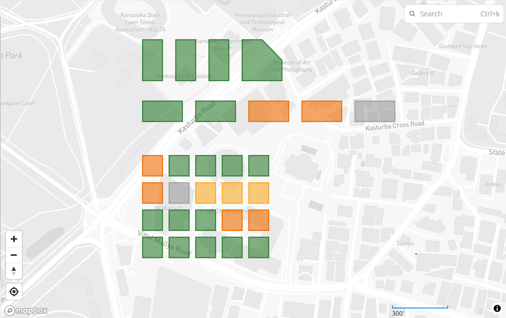

# Parcel Reconciliation Tool

Reconciles land-parcel **records** (CSV) with parcel **polygons** (GeoJSON) and reports, for every CSV row, whether it matches the map, and if not, why.



*Green = Match · Orange = IdMatchAreaMismatch · Yellow = FuzzyMatch · Grey = polygon with no CSV row.
Open [`report/report.geojson`](report/report.geojson) on GitHub to see it as an interactive map.*

---

## Quick start (≈ 2 minutes)

Requires **Python 3.10+**.

```bash
git clone https://github.com/sidz07734/latlong-reconcile.git
cd latlong-reconcile
python -m venv .venv
```
Activate the environment:
- Windows (PowerShell): `.venv\Scripts\Activate.ps1`
- macOS / Linux: `source .venv/bin/activate`

```bash
pip install -r requirements.txt
python reconcile.py --csv sample_data/parcels.csv --geojson sample_data/parcels.geojson --out ./report/
```

Expected output:
```
INFO: Wrote report/report.csv
INFO: Wrote report/report.geojson
INFO: Summary: 33 rows: Match=18 IdMatchAreaMismatch=7 FuzzyMatch=4 NoMatch=4 | polygons without a CSV row: 1
```

Run the tests:
```bash
python -m pytest -q        # 16 passed
```

## Options

| Flag | Default | Meaning |
|---|---|---|
| `--csv` | *required* | Parcel records CSV (`parcel_id, owner, area_sqm, village`) |
| `--geojson` | *required* | Parcel polygons, each with a `parcel_id` property |
| `--out` | `./report/` | Output folder (created if missing) |
| `--tolerance` | `10` | Allowed area difference, in **percent** (e.g. `--tolerance 5`) |
| `--max-distance` | `2` | Max Levenshtein distance for a fuzzy ID match |

Bad input (missing file, missing column, non-JSON GeoJSON) exits with code 1 and a one-line error, not a traceback.

## Outputs

**`report.csv`**: every original CSV row, **unchanged**, plus:

| Column | Example |
|---|---|
| `verdict` | `IdMatchAreaMismatch` |
| `matched_parcel_id` | `BLR-009` |
| `reason` | `Exact ID match; CSV 1500 m² vs map 1081.5 m² (+38.7%, outside ±10%)` |

**`report.geojson`**: every input polygon (still in lon/lat) plus `verdict`, `csv_parcel_id`, `reason`, `map_area_sqm`, and `fill`/`stroke` colours so it renders colour-coded on GitHub or [geojson.io](https://geojson.io).

## Verdicts

| Verdict | Rule |
|---|---|
| **Match** | Exact ID, and map area within ±tolerance of `area_sqm` |
| **IdMatchAreaMismatch** | Exact ID, but area outside tolerance **or** `area_sqm` missing / non-numeric |
| **FuzzyMatch** | No exact ID; exactly one closest unclaimed map ID within edit distance ≤ 2. Always flagged for human review; the area check result is included in the reason |
| **NoMatch** | No candidate, **or** several candidates tie for closest (listed in the reason) |

Polygons that no CSV row points to are tagged **`NoCsvRecord`** in `report.geojson`.

## How it works

```
load → clean → compute area (metric CRS) → match IDs → decide verdict → write reports
```

```
reconcile.py          CLI only: arguments, logging, exit code
recon/
  loader.py           read + validate CSV and GeoJSON
  cleaner.py          trim / normalise case / coerce area to number
  geometry.py         reproject to UTM and compute area in m²
  matcher.py          exact match, Levenshtein fuzzy match, tie handling
  verdict.py          4-verdict decision + human-readable reason
  pipeline.py         wires the steps together (no I/O)
  report.py           writes report.csv / report.geojson, summary line
tests/                16 pytest tests
sample_data/          33-row CSV + 29-polygon GeoJSON covering every case
```

## Design note

### CRS and area calculation
GeoJSON coordinates are longitude/latitude in **degrees** (EPSG:4326). Computing `.area` on them gives "square degrees" (≈ `9e-08` for these parcels), which is meaningless, and a degree of longitude also shrinks with latitude.
Before measuring, each polygon is **reprojected to its local UTM zone** using `GeoDataFrame.estimate_utm_crs()` (for Bangalore: **EPSG:32643, UTM 43N**). UTM is a metric projection with negligible area distortion at parcel scale, so `.area` returns true m² (e.g. a 0.0003° × 0.0003° parcel = **1081.5 m²**).
The zone is detected from the data rather than hard-coded, so the tool works for any region. Area is computed on a projected **copy**; the output GeoJSON keeps the original lon/lat geometry, which is what web maps expect.
A test (`test_area_is_in_square_metres_not_degrees`) guards against regressing to degree-based area.

### Matching decisions
- **Cleaning fixes format, never content.** Whitespace and case are normalised (`" blr-002 "` → `BLR-002`), but `BLR-O13` (letter O) is *not* auto-corrected to `BLR-013`. Silently rewriting land-record IDs is risky; it goes to fuzzy matching and human review instead.
- **Fuzzy matching only considers unclaimed polygons.** A polygon already matched exactly by another row is excluded. Otherwise `BLR-999` (2 edits from `BLR-009`) would take Ravi's parcel.
- **Ties are never guessed.** `BLR-01Z` is 1 edit from `BLR-012`, `-013`, `-014` and `-015`; it becomes `NoMatch` with all four candidates listed in the reason.
- **Missing area on an exact ID → `IdMatchAreaMismatch`**, because the area cannot be verified, with the reason saying so.
- **Area difference is relative to the map area**: `(csv − map) / map`, treating the survey polygon as the reference.
- **Duplicate claims are flagged**: if two rows point at the same polygon, both reasons carry a warning.

### One improvement with more time
**Use more evidence than the ID string for fuzzy matches.** Today, fuzzy candidates are ranked by edit distance alone. I would add (1) a weighted edit distance where common typing/OCR confusions (`O↔0`, `I↔1`, `Z↔2`, `S↔5`) cost less than arbitrary substitutions, and (2) tie-breakers using the CSV `village` vs the polygon's village and area agreement. That would resolve cases like `BLR-01Z` automatically when the evidence is clear, and report a confidence score instead of a flat "needs review".

## Data choice

The provided `parcels.geojson` was wrapped in RTF (`{\rtf1\ansi...`), so it is not valid JSON; the tool reports this clearly instead of crashing. `sample_data/parcels.geojson` is the same 28 polygons with the RTF wrapper removed.

I kept the provided 30 CSV rows (they already trigger all four verdicts) and added cases they did not cover:

| Added | Purpose |
|---|---|
| `BLR-001, R. Kumar, N/A` | Duplicate claim on one parcel + non-numeric area |
| `BLR-O25, Irfan, 1500, "  INDIRANAGAR "` | Fuzzy match whose area is **also** off (−30.7%) |
| `BLR-029, Jyothi, "3,790"` + a 5-sided polygon | Thousands separator in area; non-rectangular geometry (3785.3 m²) |

## Assumptions
- Input GeoJSON with no declared CRS is treated as EPSG:4326 (the GeoJSON standard).
- `parcel_id` comparison is case- and whitespace-insensitive.
- The tolerance boundary is inclusive (exactly ±10% is a Match).
- A polygon claimed by several rows takes the verdict of the first row in `report.geojson`; all rows keep their own verdicts in `report.csv`.
