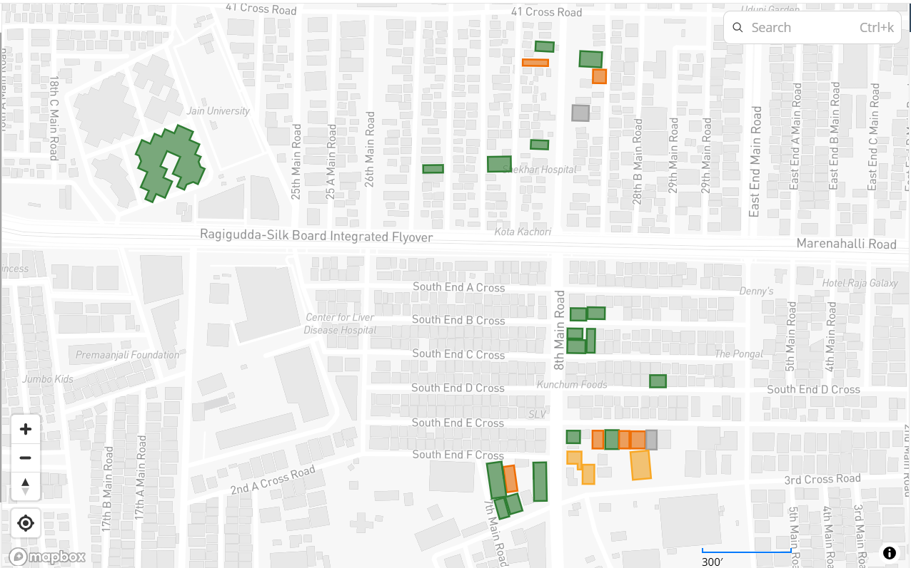

# Parcel Reconciliation Tool

Reconciles land-parcel **records** (CSV) with parcel **polygons** (GeoJSON) and reports, for every CSV row, whether it matches the map, and if not, why.



*Green = Match · Orange = IdMatchAreaMismatch · Yellow = FuzzyMatch · Grey = polygon with no CSV row.
The polygons are **real building footprints in J. P. Nagar, Bengaluru** (© OpenStreetMap contributors, ODbL), so they sit exactly on real structures.
Open [`report/report.geojson`](report/report.geojson) on GitHub to see it as an interactive map.*

---

## Quick start (≈ 2 minutes)

Requires **Python 3.10+**.

```bash
git clone https://github.com/sidz07734/latlong-reconcile.git
cd latlong-reconcile
python -m venv .venv
```
Activate the environment:
- Windows (PowerShell): `.venv\Scripts\Activate.ps1`
- macOS / Linux: `source .venv/bin/activate`

```bash
pip install -r requirements.txt
python reconcile.py --csv sample_data/parcels.csv --geojson sample_data/parcels.geojson --out ./report/
```

Expected output:
```
INFO: Wrote report/report.csv
INFO: Wrote report/report.geojson
INFO: Summary: 33 rows: Match=18 IdMatchAreaMismatch=7 FuzzyMatch=3 NoMatch=5 | polygons without a CSV row: 2
```

Run the tests:
```bash
python -m pytest -q        # 20 passed
```

## Options

| Flag | Default | Meaning |
|---|---|---|
| `--csv` | *required* | Parcel records CSV (`parcel_id, owner, area_sqm, village`) |
| `--geojson` | *required* | Parcel polygons, each with a `parcel_id` property |
| `--out` | `./report/` | Output folder (created if missing) |
| `--tolerance` | `10` | Allowed area difference, in **percent** (e.g. `--tolerance 5`) |
| `--max-distance` | `2` | Max Levenshtein distance for a fuzzy ID match |

Bad input (missing file, missing column, non-JSON GeoJSON) exits with code 1 and a one-line error, not a traceback.

## Outputs

**`report.csv`**: every original CSV row, **unchanged**, plus:

| Column | Example |
|---|---|
| `verdict` | `IdMatchAreaMismatch` |
| `matched_parcel_id` | `BLR-009` |
| `reason` | `Exact ID match; CSV 277 m² vs map 199.9 m² (+38.6%, outside ±10%)` |

**`report.geojson`**: every input polygon (still in lon/lat) plus `verdict`, `csv_parcel_id`, `reason`, `map_area_sqm`, and `fill`/`stroke` colours so it renders colour-coded on GitHub or [geojson.io](https://geojson.io).

## Verdicts

| Verdict | Rule |
|---|---|
| **Match** | Exact ID, and map area within ±tolerance of `area_sqm` |
| **IdMatchAreaMismatch** | Exact ID, but area outside tolerance **or** `area_sqm` missing / non-numeric |
| **FuzzyMatch** | No exact ID; exactly one closest unclaimed map ID within edit distance ≤ 2, **and** its area agrees (or the CSV area is missing). Always flagged for human review |
| **NoMatch** | No candidate, **or** several candidates tie for closest (listed in the reason), **or** the closest ID's area clearly disagrees (candidate named in the reason) |

Polygons that no CSV row points to are tagged **`NoCsvRecord`** in `report.geojson`.

## How it works

```
load → clean → compute area (metric CRS) → match IDs → decide verdict → write reports
```

```
reconcile.py          CLI only: arguments, logging, exit code
recon/
  loader.py           read + validate CSV and GeoJSON
  cleaner.py          trim / normalise case / coerce area to number
  geometry.py         reproject to UTM and compute area in m²
  matcher.py          exact match, Levenshtein fuzzy match, tie handling
  verdict.py          4-verdict decision + human-readable reason
  pipeline.py         wires the steps together (no I/O)
  report.py           writes report.csv / report.geojson, summary line
tests/                20 pytest tests
sample_data/          33-row CSV + 29 real building footprints (J. P. Nagar) covering every case
  company_original/   the provided CSV and GeoJSON (RTF wrapper removed), kept for reference
```

## Tests

Not required by the brief, but added to prove correctness and lock in the design decisions. Run with `python -m pytest -q` (20 tests).

| File | What it checks |
|---|---|
| `test_matcher.py` | Levenshtein edits (swap/insert/delete); exact match wins; unique fuzzy match; ties are reported as ambiguous, never guessed; a typo cannot take a parcel that already has an exact owner |
| `test_verdict.py` | All four verdicts; exactly ±10% counts as Match; missing area → IdMatchAreaMismatch; fuzzy matches always flagged for review; fuzzy match with clearly wrong area is rejected |
| `test_cleaner_geometry.py` | Cleaning fixes format (spaces, case, `"1,080"`, `"N/A"`) but not content (`BLR-O13` is left for the matcher); area is in m², not degrees |
| `test_end_to_end.py` | Full run on `sample_data/` produces all four verdicts; the provided company files still run; every sample polygon is a real OSM building located in J. P. Nagar |

## Design note

### CRS and area calculation
GeoJSON coordinates are longitude/latitude in **degrees** (EPSG:4326). Computing `.area` on them gives "square degrees" (≈ `1.7e-08` for building BLR-001), which is meaningless, and a degree of longitude also shrinks with latitude.
Before measuring, each polygon is **reprojected to its local UTM zone** using `GeoDataFrame.estimate_utm_crs()` (for Bangalore: **EPSG:32643, UTM 43N**). UTM is a metric projection with negligible area distortion at parcel scale, so `.area` returns true m² (e.g. building BLR-001 = **209.7 m²**).
The zone is detected from the data rather than hard-coded, so the tool works for any region. Area is computed on a projected **copy**; the output GeoJSON keeps the original lon/lat geometry, which is what web maps expect.
A test (`test_area_is_in_square_metres_not_degrees`) guards against regressing to degree-based area.

### Matching decisions
- **Cleaning fixes format, never content.** Whitespace and case are normalised (`" blr-002 "` → `BLR-002`), but `BLR-O13` (letter O) is *not* auto-corrected to `BLR-013`. Silently rewriting land-record IDs is risky; it goes to fuzzy matching and human review instead.
- **Fuzzy matching only considers unclaimed polygons.** A polygon already matched exactly by another row is excluded. Otherwise `BLR-999` (2 edits from `BLR-009`) would take Ravi's parcel.
- **Ties are never guessed.** `BLR-01Z` is 1 edit from `BLR-012`, `-013`, `-014` and `-015`; it becomes `NoMatch` with all four candidates listed in the reason.
- **Missing area on an exact ID → `IdMatchAreaMismatch`**, because the area cannot be verified, with the reason saying so.
- **Area difference is relative to the map area**: `(csv − map) / map`, treating the survey polygon as the reference.
- **A fuzzy candidate must also agree on area.** A similar ID alone is weak evidence. If the closest ID's polygon is outside the area tolerance, the match is rejected (NoMatch) and the candidate is named in the reason. Example: `BLR-O25` is 1 edit from `BLR-025`, but 181 m² vs 261.1 m² (−30.7%) makes it clearly a different parcel. (I found the need for this rule when an earlier dataset fuzzy-matched `BLR-999` to a parcel 3.5× its size.) If the CSV area is missing, the fuzzy match is kept for review.
- **Duplicate claims are flagged**: if two rows point at the same polygon, both reasons carry a warning.

### One improvement with more time
**Use more evidence than the ID string for fuzzy matches.** Today, fuzzy candidates are ranked by edit distance alone. I would add (1) a weighted edit distance where common typing/OCR confusions (`O↔0`, `I↔1`, `Z↔2`, `S↔5`) cost less than arbitrary substitutions, and (2) tie-breakers using the CSV `village` vs the polygon's village and area agreement. That would resolve cases like `BLR-01Z` automatically when the evidence is clear, and report a confidence score instead of a flat "needs review".

## Data choice

**Geometry: real building footprints.** The provided `parcels.geojson` was wrapped in RTF (not valid JSON), and its polygons are synthetic: identical 0.0003° grid squares labelled Koramangala/Indiranagar but actually located near Cubbon Park (12.97°N, 77.59°E), so they don't line up with anything on a real map. For `sample_data/` I therefore used **29 real building footprints from OpenStreetMap** around J. P. Nagar 3rd Phase and Marenahalli, Bengaluru (exported from openstreetmap.org, bounding box 12.911–12.919°N, 77.590–77.600°E). OSM has no public cadastral parcels for India, so building outlines stand in for parcels. Each feature keeps its `osm_way_id` for traceability. Areas range from about 155 m² (houses) to 2,950 m² (a 39-vertex complex, `BLR-029`), so the area check runs on real, irregular shapes.

**Records: the provided test cases, rebuilt on real geometry.** The CSV keeps the provided 30 rows' IDs, owners and error types, with areas recomputed from the real footprints and the same planted deviations applied (e.g. `BLR-009` +38.7%, `BLR-023` −53.8%; clean matches within ±1%). Villages are the real localities. I added 3 rows for cases the provided data did not cover:

| Added | Purpose |
|---|---|
| `BLR-001, R. Kumar, N/A` | Duplicate claim on one parcel + non-numeric area |
| `BLR-O25, Irfan, 181, "  MARENAHALLI "` | Near-miss ID whose area is **also** off (−30.7%) → fuzzy candidate rejected |
| `BLR-029, Jyothi, "2,953"` | Thousands separator in area, on the largest, most irregular footprint |

**The provided files still work.** They are kept unchanged in `sample_data/company_original/`:
```bash
python reconcile.py --csv sample_data/company_original/parcels.csv --geojson sample_data/company_original/parcels.geojson --out ./report_original/
# 30 rows: Match=17 IdMatchAreaMismatch=6 FuzzyMatch=3 NoMatch=4 | polygons without a CSV row: 2
```

## Assumptions
- Input GeoJSON with no declared CRS is treated as EPSG:4326 (the GeoJSON standard).
- `parcel_id` comparison is case- and whitespace-insensitive.
- The tolerance boundary is inclusive (exactly ±10% is a Match).
- A polygon claimed by several rows takes the verdict of the first row in `report.geojson`; all rows keep their own verdicts in `report.csv`.
